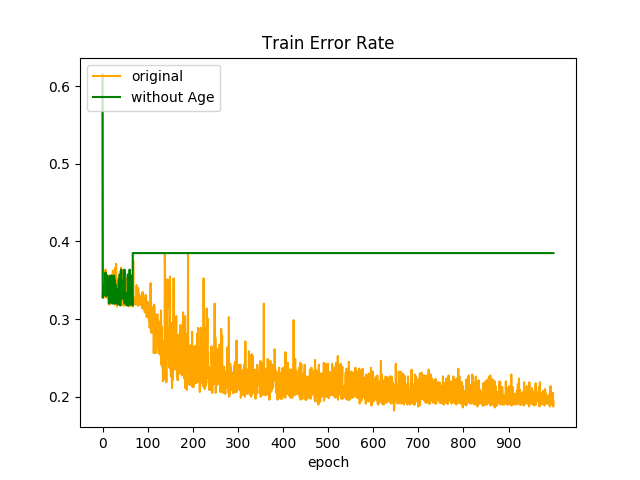
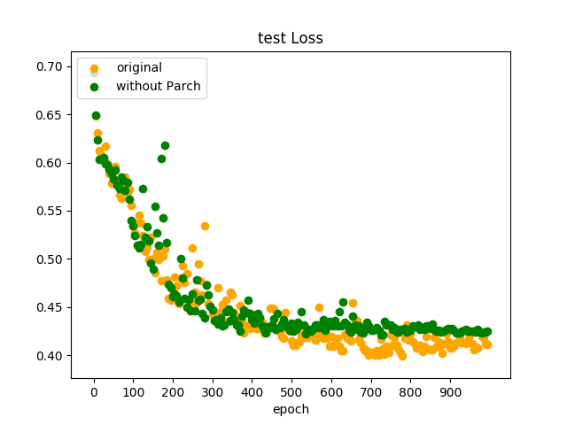

# Deep Learning (Homework 1)

### Deep Neural Network for Classification
In this exercise, please implement a Deep Neural Network (DNN) model to predict if one can survive in the Titanic tragedy. This dataset is collected from a Kaggle competition and cleaned by TAs. The features include: sex, age of a person; how many parents or children,and how many siblings or spouses are on board related to the person; the ticket class and the passenger fare are also included. Please create a DNN model inputs these features and outputs the survival of passengers. The details of this dataset can be referred to: !(https://www.kaggle.com/c/titanic/data). The cleaned data is provided in titanic.csv, please take the first 800 rows as training data and the last 91 rows as test data. The first column, the survival, should be treated as label, while the other six columns are features. In the sex column,1 indicates male while 0 indicates female. In the age column, the empty entries are filled with zeros.

#### 1.Please construct a DNN for binary classification. For N samples and K categories, the cross entropy objective function is expressed by <math>  Please minimize the objective function E(w) by error backpropagation algorithm using the Stochastic Gradient Descent (SGD) where the parameter updating in each mini-batch is yielded by w (τ +1) = w (τ ) − η∇E(w (τ ) ). You should decide the following variables: number of hidden layers, number of hidden units for each layer, learning rate, number of iterations and mini-batch size. Please show (a) learning curve, (b) training error rate and (c) test error rate in the report. The network architecture should be designed by yourself. Please describe the architecture of your model and explain why you design or choose such an architecture.

#### ANS=

#### 2.Please construct a DNN with a specified architecture. The number of units in layers should be arranged as [6 3 3 2], corresponding to those of input layer, first and second hidden layers, and output layer. This network has the same inputs and outputs as provided.

#### ANS=

  
  

  
  

In the training process, I select **lr = 1e-02** and **decay 0.96** in every 10 batch iteration. 
In the validation process, In every 100 epoch, I will evaluate the test error rate and test loss to ensure the loss and test rate have the decay trend. OverAll, I train 1000 epoch. batch size I select 8. Some experiment shows that if I didn't initialize Weight Matrix on (-0.1,0.1) or more small scope, it will crash the accuracy and stuck on the scope of 0.6 +-0.04 .

#### 3.Look into the features. Please perform normalization for the Fare feature and compare the error rate with the original network. For normalization process, you may refer to https://en.wikipedia.org/wiki/Standard_score. Are there any other features that need to be normalized? Please answer in the report.

#### ANS=

  
  

  
  

In this Part, I standardize the number on Fare, and re-train the model on the same architecture.Also, we can see that the fare value will little affect the accuracy in the test, and decrease the accuracy from 0.80 -> 0.78

#### 4.Please identify which feature affects the prediction performance the most. Describe the process how you solve this problem in the report.

#### ANS=

In this part, My method will take the one column value all to be zero, which means I take out the column from data.Below shows the result.

  
  

  
  

* * *
<!--  -->

  
  

  
  

* * *

  
  

  
  

* * *

  
  

  
  

* * *

  
  

  
  

* * *

  
  

  
  

* * *

Some important picture shows that when take out sex column, the accuracy will drop to 0.69+-0.05. 
Also,Without Age column, model will drop the accuracy to 0.61 on even train or test set.
 On the opposite, as you can see that without other column except for age or sex, the perfomance will not drop a lot .

#### 5.When the feature is categorical with more than three categories, we often transform the categories into one-hot vectors. Should we perform the same process to the feature of ticket class? Please show your explanations and illustrations in the report.

#### ANS= 
I think ticket class just have three class(little) and will not affect performance when we encode them to one-hot vectors because the ticket class will have a natural order relationship. Unlike three color; assume we have Blue, Gree, Red, three color. if it be a attribute for data, we need to encode them to number. If we just use integer to represent them (exp:blue=1,red=2, green=3), it will get a natural order on integer representation, but actually they didn't have a order relationship, so we will use one-hot vector to encode them.Turn Back to ticket class, they have a natural order on themselves, so they should just consider to encode into integer representation.But did one-hot encoding perform better ?To answer this question, I do a experiment that encode pclass to one-hot vector.Result shows below. As the picture shown, the performance didn't affect more by encode pclass into one-hot vector.

  
  

  
  

#### 6.Please artificially design two new samples that one can survive and the other can not. For example, a person with the following feature: pclass=3, sex=1, age=25, sibsp=2, parch=2, fare=10. Input this new sample to the model and see the result is survived or not. Explain how you choose these samples to achieve correction classification.

#### ANS= 
I choose **pclass=1, sex=0, age=30, sibsp=0, parch=0, fare=70** which can survive on the Titanic, the other one data I select **pclass=3 sex=1, age=20, sibsp=0,parch=0, fare=40** that will died on the Titanic. The result I will choose that because my model has a very critical Sexual discrimination. I guess that sex=0 is about to woman, and sex=1 is about to man. The model will discriminate the death when your input is boy, and discriminate survived when your input is girl.Secondly, the pclass affect about 10% on performance and make decision to survived and death. If pclass = 1, the probability of survived will rise up,On the opposite, when pclass = 3, the probability of death will rise up.This two feature affect more when model make its decision. In addition, model will choose younger people to survived.The younger people be the model input, The higher survived probability will output.

In the first Case, the results shows  [[0.06185877 0.93814123]]. Survived probability is 0.93814123, and Death probability is 0.0618   the Second Case, the results shows [[0.872694 0.1273]]. Survived probability is 0.1273 , and the probability of Death is 0.872694.

## Appendix

  

